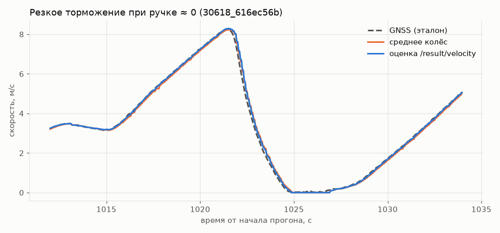
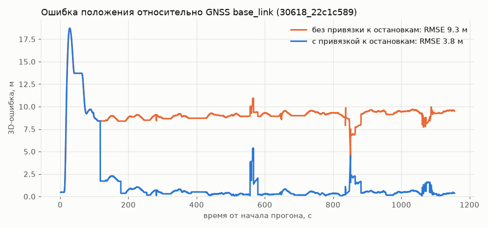

# Tram Reserve Odometry v2

**Резервная одометрия трамвая для ROS 2 Humble по трём разрешённым сигналам:**

- `/vehicle/front_bogie_velocity` — скорость передней тележки;
- `/vehicle/rear_bogie_velocity` — скорость задней тележки;
- `/vehicle/driver_position_cmd` — положение контроллера водителя.

Решение оценивает продольную скорость и положение трамвая **в реальном времени без GNSS и IMU в основном контуре**. GNSS используется только для стартовой выставки и офлайн-оценки точности.

---

## 1. Кратко о решении

В основе решения — **гибридная физико-статистическая модель**:

1. нелинейная модель тяги и торможения как функция положения контроллера и скорости;
2. продольная динамика трамвая на основе второго закона Ньютона;
3. Davis-like модель сопротивления движению;
4. динамика тягового привода первого порядка;
5. робастная оценка состояния `[distance, velocity, acceleration]`;
6. multiple-model observer для режимов:
   - normal;
   - front slip;
   - rear slip;
   - common-mode slip;
7. NIS gating + Huber robust update для подавления выбросов;
8. zero-velocity constraint на подтверждённых остановках;
9. медленная адаптация model bias при надёжной одометрии;
10. map-constrained position по `pathgraph`, если карта доступна.

Цель решения — сохранить высокую точность обычной одометрии в нормальном режиме, но **не доверять колесным скоростям безусловно**, когда появляется буксование, юз, выбросы или рассогласование между тележками.

Подробные уравнения приведены в [`MATH_MODEL.md`](MATH_MODEL.md).

---

# 2. Соответствие требованиям кейса

| Требование | Реализация |
|---|---|
| Нелинейная математическая модель | нелинейная notch-speed модель + longitudinal dynamics |
| Модель тягового привода | first-order actuator dynamics, optional motor torque model |
| Продольная динамика | traction/brake + resistance + grade + curve term |
| Проскальзывание | 4-mode adhesion observer + adaptive wheel weights |
| Выбросы | NIS gating + Huber robustification |
| Пропуски данных | prediction по динамической модели до восстановления измерений |
| Изменяющиеся параметры | adaptive acceleration bias |
| Работа без GNSS/IMU | да, после стартовой инициализации |
| `/result/velocity` | `tram_vehicle_msgs/msg/VelocitySensor` |
| `/result/position` | `nav_msgs/msg/Odometry` |
| Real-time | O(1) память, матрицы 3×3, без нейросети |
| Диагностика | `/result/diagnostics`, `/result/latency_ms` |
| Карта пути | поддерживается CSV pathgraph `x,y,z` |

---

# 3. Математическая модель

## 3.1. Продольная динамика

Используется одно-массовая модель железнодорожного экипажа:

\[
m_{eq}\dot v =
F_{tr}(u,v)
-
F_{br}(u,v)
-
F_R(v)
-
F_g(s)
-
F_c(s)
+
F_d(t).
\]

Здесь:

- \(v\) — продольная скорость `base_link`;
- \(u\) — нормированное положение контроллера;
- \(F_{tr}\), \(F_{br}\) — тяга и торможение;
- \(F_R\) — сопротивление движению;
- \(F_g\) — сопротивление/ускорение от уклона;
- \(F_c\) — сопротивление в кривой;
- \(F_d\) — медленные неучтённые возмущения.

Положение контроллера нормируется:

\[
u = k / 15,
\qquad
u_+ = \max(u,0),
\qquad
u_- = \max(-u,0).
\]

Так как паспортные характеристики двигателя и часть параметров экипажа организаторами пока не предоставлены, идентифицируется **удельная сила \(F/m\)**:

\[
a_{id}(u,v)=
\theta_0+
\theta_1u_+
+\theta_2u_+^2+
\theta_3u_-
+\theta_4u_-^2+
\theta_5v+
\theta_6v|v|+
\theta_7u_+v+
\theta_8u_-v.
\]

Коэффициенты \(\theta\) калибруются на разрешённых train-bag.

## 3.2. Сопротивление движению

Используется Davis-like структура

\[
F_R=A+Bv+Cv^2.
\]

В удельной модели ей соответствуют константный, линейный и квадратичный по скорости члены.

## 3.3. Динамика привода

Тяга/торможение не изменяются мгновенно:

\[
\tau_a\dot a + a = a_{eq}.
\]

При дискретизации:

\[
\rho=e^{-\Delta t/\tau_a},
\]

\[
\begin{aligned}
s_{k+1} &= s_k+v_k\Delta t+\frac12a_k\Delta t^2,\\
v_{k+1} &= v_k+a_k\Delta t,\\
a_{k+1} &= \rho a_k+(1-\rho)a_{eq,k}+w_k.
\end{aligned}
\]

Состояние оценивателя:

\[
x=[s,v,a]^T.
\]

## 3.4. Уклон и карта

Если в `pathgraph` присутствует высота \(z(s)\),

\[
q(s)=\frac{dz}{ds},
\qquad
a_g=-g\frac{q}{\sqrt{1+q^2}}.
\]

Кривизна пути оценивается по изменению касательной к траектории и может использоваться дополнительным калибруемым членом сопротивления.

---

# 4. Обнаружение проскальзывания и аномалий

Входные скорости тележек по уточнению организаторов интерпретируются как **км/ч** и сразу переводятся в м/с:

\[
z_i = v_i^{raw}/3.6.
\]

В нормальном режиме:

\[
z_i=v+\varepsilon_i.
\]

Используется four-mode observer:

\[
M\in\{N,F,R,C\},
\]

где:

- `N` — normal;
- `F` — front slip;
- `R` — rear slip;
- `C` — common-mode slip обоих колесных каналов.

Для определения режима учитываются:

- инновация передней тележки \(z_f-v^-\);
- инновация задней тележки \(z_r-v^-\);
- \(|z_f-z_r|\);
- противоречие между наблюдаемым ускорением и ускорением модели.

Это позволяет обнаруживать не только ситуацию, когда две тележки расходятся, но и случай, когда **обе показывают похожую, но неверную скорость**.

Для каждого колесного измерения адаптивно меняется статистический вес. Дополнительно используются:

- **NIS gating** для больших инноваций;
- **Huber-like update** для одиночных выбросов;
- **Joseph covariance update** для устойчивости фильтра.

При деградации колесной одометрии оценка кратковременно больше опирается на математическую модель движения.

---

# 5. Положение

## 5.1. Начальная выставка

Организаторами задана геометрия антенн в `base_link`:

```text
master: x = -9.873 m, y = 0, z = 3.0 m
rover:  x =  2.563 m, y = 0, z = 3.0 m
```

Расстояние между передней и задней тележками:

```text
7.55 m
```

`base_link` расположен на оси вращения передней тележки на уровне контакта колесо–рельс.

GNSS может использоваться только в коротком стартовом окне для определения начальной позиции и направления. После этого GNSS не входит в рабочий estimator.

## 5.2. С картой (режим по умолчанию)

\[
p(t)=\Gamma\big(s_0+\sigma s(t)\big)+e^{-(s(t)-s(t_0))/L_j}\,\delta_0,
\]

где \(\Gamma(s)\) — метрическая осевая линия пути, \(s(t)\) — пройденная дистанция из фильтра, \(\sigma=\pm1\) — направление.
\(\delta_0\) — начальное смещение GNSS-позиции от маршрута (старт на соседнем тупике/стоянке), которое гасится на длине \(L_j\) = `join_length_m`.

**Система координат.** Карта организаторов (`map_coordinates/*.json`) задана в сетке
`UTM 37N − (300000, 6100000)`; GNSS прогонов ложится на пути карты с медианным отклонением ~5 см.
Выход `/result/position` публикуется **в этой же системе** (`frame_id: map`); сдвиг задаётся
параметрами `utm_zone`, `grid_offset_easting`, `grid_offset_northing`. `z` — высота рельса по карте
(`base_link` на уровне контакта колесо–рельс; антенны на ~3.1 м выше).

**Маршрут** `config/route.json` строится офлайн `tools/build_route.py`:

```text
тупик Таллинской → TS (официальный) → кольцо Щукинской → ST (официальный) → тупик Таллинской
```

Официальный pathgraph содержит только два пути линии; прогоны же начинаются и заканчиваются на конечных,
которых в pathgraph нет (до ~600 м в начале ST-прогонов и ~500 м в конце TS-прогонов). Эти участки
сняты по GNSS base_link обучающих прогонов (как и сам pathgraph — это подготовка карты, GNSS в рабочем
контуре не используется). Пути ST и TS идут в 3.5 м друг от друга, поэтому начальная привязка к маршруту
выполняется с учётом курса (два антенны → yaw).

**Привязка к остановкам.** Масштаб колёсной одометрии отличается от прогона к прогону на ±1.5%
(износ бандажей), что даёт ~1.5% дрейфа вдоль пути. В `route.json` сохранены 23 точки остановок на
платформах (повторяемость по прогонам — межквартильный размах < 1.5 м). Когда фильтр подтверждает
стоянку дольше `stop_anchor_min_s` и ближайшая остановка находится в пределах `stop_anchor_window_m`,
продольная координата подтягивается к ней с коэффициентом `stop_anchor_gain`.

Ориентация кузова определяется по геометрии пути и известной базе тележек 7.55 м.

## 5.3. Без карты

Доступен только straight-line fallback:

\[
x=x_0+s\cos\psi_0,
\qquad
y=y_0+s\sin\psi_0.
\]

На кривых такой режим неизбежно накапливает ошибку. Это ограничение наблюдаемости: из двух скалярных wheel-speed и controller command нельзя восстановить глобальную кривизну пути без карты или внешнего ориентира.

---

# 6. ROS 2 интерфейс

## Входы

```text
/vehicle/front_bogie_velocity
    tram_vehicle_msgs/msg/VelocitySensor

/vehicle/rear_bogie_velocity
    tram_vehicle_msgs/msg/VelocitySensor

/vehicle/driver_position_cmd
    tram_vehicle_msgs/msg/DriverControllerCommand
```

GNSS используется только для стартовой выставки:

```text
/sensing/gnss/master/fix
/sensing/gnss/master/vel
/sensing/gnss/rover/fix
/sensing/gnss/rover/vel
```

## Обязательные выходы

```text
/result/velocity
    tram_vehicle_msgs/msg/VelocitySensor

/result/position
    nav_msgs/msg/Odometry
```

В выходных сообщениях используется timestamp входного сообщения, а не wall-clock time.

## Дополнительная диагностика

```text
/result/diagnostics
/result/latency_ms
/result/model_motor_torque_nm
```

`/result/diagnostics` (`geometry_msgs/msg/TwistStamped`):

```text
linear.x  = overall slip score
linear.y  = front wheel effective weight
linear.z  = rear wheel effective weight

angular.x = model acceleration
angular.y = adaptive acceleration bias
angular.z = common-mode-slip probability
```

`/result/model_motor_torque_nm` имеет физический смысл только если в конфигурации заданы масса, радиус колеса, передаточное отношение и эффективность привода.

---

# 7. Быстрый запуск для жюри

## Требования

- Ubuntu 22.04;
- ROS 2 Humble;
- `colcon`;
- `rosbag2`;
- Python 3.

Из корня проекта:

```bash
source /opt/ros/humble/setup.bash

colcon build --base-paths src --symlink-install
source install/setup.bash
```

> `--base-paths src` важен, если вместе с dataset присутствует ещё одна копия `tram_vehicle_msgs`.

## Terminal 1 — estimator

```bash
source /opt/ros/humble/setup.bash
source install/setup.bash

ros2 launch tram_reserve_odometry run.py
```

Ожидаемый лог:

```text
Reserve odometry ready; wheel speed is interpreted as km/h and converted to m/s
```

## Terminal 2 — rosbag

```bash
source /opt/ros/humble/setup.bash
source install/setup.bash

ros2 bag play /path/to/<bag_id>
```

Например:

```bash
BAG=$(find dataset/data -name metadata.yaml | head -1 | xargs dirname)
ros2 bag play "$BAG"
```

## Terminal 3 — проверка результата

```bash
source /opt/ros/humble/setup.bash
source install/setup.bash

ros2 topic echo /result/velocity
```

Положение:

```bash
ros2 topic echo /result/position
```

Частота:

```bash
ros2 topic hz /result/velocity
ros2 topic hz /result/position
```

Диагностика:

```bash
ros2 topic echo /result/diagnostics
ros2 topic echo /result/latency_ms
```

---

# 8. Калибровка на предоставленном dataset

Калибровка не требует ROS и может выполняться отдельно:

```bash
python3 -m pip install numpy
```

```bash
python3 tools/calibrate_from_bags.py dataset/data \
  --out calibration.json \
  --val-fraction 0.20
```

Split выполняется **по целым bag**, чтобы соседние отсчёты одного и того же прогона не попадали одновременно в train и validation.

После калибровки скрипт печатает:

```text
Paste into odom_params.yaml:
dynamics_coeffs: [...]
```

Полученные коэффициенты необходимо перенести в:

```text
src/tram_reserve_odometry/config/odom_params.yaml
```

GNSS при офлайн-калибровке и оценке может использоваться как reference; после стартового окна runtime estimator от GNSS не зависит.

---

# 9. Offline evaluation

`tools/replay_eval.py` воспроизводит bag **через тот же код, что работает в ноде** (`core.py`):
сообщения подаются в порядке записи, GNSS — только через окно инициализации. Метрики как у жюри:
пары «выход ↔ эталон» по ближайшему `stamp` в пределах 0.05 с.

```bash
python3 tools/replay_eval.py task_description/data --out replay.csv
# любые параметры можно переопределить:
python3 tools/replay_eval.py task_description/data --set stop_anchor_gain=0.0
```

- скорость: RMSE/MAE/bias относительно |`/sensing/gnss/master/vel`|, плюс baseline «среднее колёс»;
- положение: 3D-ошибка относительно GNSS `base_link` (обе антенны + TF), along/cross-track,
  финальная ошибка в % от пройденного пути.

### Результаты (отложенные прогоны)

97 уникальных прогонов (25 из 122 — побайтные дубли). Детерминированный split по имени:
68 train / 29 val. Маршрут, остановки и параметры фильтра подбирались **только на train**:

| Метрика (val) | Исходная версия | Текущая |
|---|---|---|
| Скорость, RMSE pooled | 0.084 м/с | **0.083** м/с (сырые колёса: 0.295) |
| Позиция, RMSE, медиана по прогонам | ~2500 м (прямая без карты) | **3.5 м** |
| Позиция, RMSE pooled | ~3600 м | **12.0 м** |
| Позиция, max, медиана по прогонам | ~7500 м | **13.9 м** |
| Cross-track RMSE, медиана | ~1900 м | **1.0 м** |
| Финальная ошибка, % пути, медиана | 66 % | **0.18 %** |
| Обработка сообщения, p99 | — | **< 0.4 мс** |

Вклад по шагам (val, медиана RMSE позиции): маршрут pathgraph + конечные — 4.3 м; привязка к остановкам — 3.5 м.
Скорость: консенсус тележек + `process_accel_sigma` 1.5 дали на train 0.140 → 0.135 м/с (pooled). Часть остаточной
ошибки — сам эталон: в ряде прогонов GNSS-скорость десятки секунд равна 0 при движущемся трамвае.

Это **не официальный score жюри**; эталон построен по той же GNSS-телеметрии, но методика жюри может отличаться.


### Проверка на тестовом бэге организаторов (`check-code`)

Эталон проверяющего скрипта — `/localization/kinematic_state` (`nav_msgs/Odometry`, `frame_id: map`,
`child_frame_id: base_link`) в той же системе координат, что и pathgraph; это подтверждает выбор выходной
системы координат. Офлайн-эквивалент `metrics.py` (пары по ближайшему `stamp` ±0.05 с):

```bash
python3 tools/checker_replay.py check-code/bags/30618_88aea4d9
```

| Бэг `30618_88aea4d9` (1310 с, GNSS только первые ~43 с) | RMSE | max |
|---|---|---|
| Скорость (vs `twist.twist.linear.x`) | **0.034 м/с** | 0.32 м/с |
| Положение x | 4.10 м | 32.3 м |
| Положение y | 4.43 м | 37.8 м |
| Положение z | 0.18 м | 1.23 м |
| Положение, 3D-расстояние | **6.04 м** | 49.7 м |

Средняя 3D-ошибка — 2.2 м; на интервале 0–1240 с ошибка 0.2–4.5 м. Хвост RMSE даёт последние ~60 с:
у Таллинской после конца ST маршрут разветвляется на северную (кольцо) и южную ветки. В обучающих
прогонах трамваи почти всегда уходили на северную, она и зашита в `route.json`; в тестовом прогоне трамвай
ушёл на южную (ошибка до ~50 м). Выбор ветки по двум скалярным скоростям колёс ненаблюдаем.

Запуск самого проверяющего скрипта в его Docker-окружении (ROS 2 Humble):

```bash
cp -r src/tram_reserve_odometry check-code/src/        # tram_vehicle_msgs там уже есть
cd check-code && ./scripts/build.sh && ./scripts/run.sh && ./scripts/enter.sh
# внутри контейнера:
colcon build --packages-select tram_vehicle_msgs hackathon_solution_checker tram_reserve_odometry
source install/setup.bash
ros2 launch tram_reserve_odometry run.py &              # оценщик
ros2 run hackathon_solution_checker metrics &          # метрики каждые 5 с и в конце
ros2 bag play bags/30618_88aea4d9                      # воспроизведение
```

### Графики

Воспроизводятся `python3 tools/plot_report.py task_description/data` (сохраняются в `docs/img/`).



Резкое торможение (~5 м/с²) при ручке контроллера около нуля: модель тяги ожидает ускорение ≈ 0,
но обе тележки согласны между собой — оценка идёт за ними и не «зависает» на прогнозе модели.



Ошибка положения на одном прогоне с привязкой к остановкам и без неё (маршрут и остановки — финальные,
собранные по всем прогонам, поэтому это иллюстрация механизма; честные цифры — в таблице выше).

---

# 10. Конфигурация

Основные параметры находятся в:

```text
src/tram_reserve_odometry/config/odom_params.yaml
```

Ключевые параметры:

```yaml
wheel_units: "kmph"

wheelbase_m: 7.55

master_x_m: -9.873
rover_x_m: 2.563
antenna_z_m: 3.0

gnss_init_seconds: 5.0

tau_accel: 0.35
wheel_sigma: 0.10
process_accel_sigma: 1.5

nis_gate: 9.0
consensus_tol_mps: 0.15   # тележки согласны -> измерение не отбрасывается гейтом

stop_speed_mps: 0.06
stop_confirm_s: 0.35

bias_adapt_gain: 0.006
grade_gain: 0.0           # уклон уже учтён в идентифицированных коэффициентах

publish_max_rate_hz: 50.0

path_file: "config/route.json"
utm_zone: 37
grid_offset_easting: 300000.0
grid_offset_northing: 6100000.0
max_path_init_lateral_m: 100.0
join_length_m: 30.0
stop_anchor_min_s: 8.0
stop_anchor_window_m: 25.0
stop_anchor_gain: 0.8
```

Параметры, которые нельзя корректно задавать без официальных данных, по умолчанию оставлены неопределёнными/нулевыми:

```yaml
vehicle_mass_kg: 0.0
wheel_radius_m: 0.0
gear_ratio: 0.0
curve_accel_per_curvature: 0.0
```

---

# 11. Производительность

Estimator не использует нейросеть и не выполняет оптимизацию по длинному временному окну.

На один входной отсчёт выполняются:

- несколько скалярных нелинейностей;
- вычисление likelihood четырёх режимов;
- операции с covariance/state размерности 3;
- публикация ROS-сообщений.

Сложность:

```text
time:   O(1) на сообщение
memory: O(1)
```

Частота публикации ограничена сверху параметром:

```yaml
publish_max_rate_hz: 50.0
```

Замер ядра оценщика на самом длинном прогоне (`30618_27e994fc`, 1900 с, 38 040 публикаций; Apple M-серия, один процесс Python):

| Метрика | Значение | Требование |
|---|---|---|
| Время обработки сообщения, p99 | 0.18 мс | ≤ 100 мс |
| Максимум (инициализация: проекция на маршрут) | ~30–40 мс | ≤ 250 мс в пике |
| Загрузка CPU | 0.24 % одного ядра | ≤ 2 ядра |
| Пиковая память процесса (с numpy и чтением bag) | 64 МБ | ≤ 0.5 ГБ |
| Частота публикации | ~21 Гц (по входам, ограничение 50 Гц) | ≥ 10 Гц |

Накладные расходы `rclpy` в этот замер не входят; на ROS 2 их нужно подтвердить через `/result/latency_ms`,
`ros2 topic hz` и `top`/`ps` для процесса ноды.

Для проверки processing latency доступен:

```bash
ros2 topic echo /result/latency_ms
```

---

# 12. Устойчивость и fail-safe поведение

Решение рассчитано на:

- выброс одного wheel-speed;
- рассогласование передней и задней тележек;
- кратковременное отсутствие одного измерения;
- front/rear wheel slip;
- common-mode slip;
- остановки;
- изменение средних сопротивлений движения;
- ошибочные единичные значения.

При подозрительном измерении фильтр не делает жёсткий скачок состояния, а уменьшает статистический вес соответствующего канала.

При восстановлении нормальных измерений estimator автоматически возвращает им высокий вес.

---

# 13. Допущения и ограничения

Основные допущения:

1. движение ограничено железнодорожным путём;
2. обе wheel-speed доступны большую часть времени;
3. controller position принадлежит диапазону `[-15, 15]`;
4. wheel-speed соответствует уточнённой организаторами единице `km/h`;
5. параметры динамики идентифицируются только на разрешённых train-данных.

Принципиальные ограничения:

- без `pathgraph` невозможно точно восстановить глобальные `x/y` на произвольных кривых только из двух scalar wheel-speed;
- маршрут и остановки сняты для линии Щукинская — Таллинская; на другом маршруте нужно пересобрать `route.json`;
- у Таллинской веер тупиков: при старте на тупике, отличном от снятого, первые десятки метров идут с поперечным смещением (гасится `join_length_m`);
- позиция не публикуется до первой пары GNSS-фиксов (или ручной инициализации) — иначе она была бы в произвольной системе;
- публикация идёт по входным сообщениям: при пропуске всех входов (в данных встречаются разрывы до ~1 с) выходов тоже нет;
- при полном синхронном slip обоих колесных каналов истинная скорость не определяется алгебраически и временно прогнозируется моделью;
- физический коэффициент сцепления \(\mu\) нельзя достоверно измерить без дополнительных силовых/контактных измерений;
- абсолютный motor torque нельзя корректно вычислить без массы, радиуса колеса и параметров передачи;
- параметр сопротивления кривой должен идентифицироваться после получения реального pathgraph.

Полный список: [`ASSUMPTIONS_AND_LIMITS.md`](ASSUMPTIONS_AND_LIMITS.md).

---

# 14. Структура проекта

```text
.
├── README.md
├── MATH_MODEL.md
├── ASSUMPTIONS_AND_LIMITS.md
├── JURY_CHECKLIST.md
├── REFERENCES.md
├── WORLD_METHODS_AND_DESIGN.md
│
├── src/
│   ├── tram_vehicle_msgs/
│   │   └── msg/
│   │       ├── VelocitySensor.msg
│   │       └── DriverControllerCommand.msg
│   │
│   └── tram_reserve_odometry/
│       ├── config/
│       │   ├── odom_params.yaml
│       │   └── route.json          # маршрут + остановки (tools/build_route.py)
│       ├── launch/
│       │   └── run.py
│       └── tram_reserve_odometry/
│           ├── node.py             # тонкая ROS-обёртка
│           ├── core.py             # оценщик без ROS (нода и офлайн-оценка)
│           ├── filter.py
│           ├── geo.py
│           └── path_model.py
│
└── tools/
    ├── build_route.py       # маршрут из pathgraph + конечные + остановки
    ├── replay_eval.py       # офлайн-прогон кода ноды с метриками жюри
    ├── plot_report.py       # графики для docs/img
    ├── checker_replay.py    # офлайн-эквивалент проверяющего скрипта организаторов
    ├── calibrate_from_bags.py
    ├── evaluate_dataset.py
    └── inspect_db3.py
```

---

# 15. Что смотреть жюри

Для быстрой проверки рекомендуем:

```bash
# 1. Запустить estimator
ros2 launch tram_reserve_odometry run.py

# 2. Проиграть bag
ros2 bag play <bag_directory>

# 3. Убедиться, что обязательные выходы публикуются
ros2 topic echo /result/velocity
ros2 topic echo /result/position

# 4. Проверить частоту
ros2 topic hz /result/velocity
ros2 topic hz /result/position

# 5. Посмотреть работу slip-observer
ros2 topic echo /result/diagnostics

# 6. Посмотреть время обработки
ros2 topic echo /result/latency_ms
```

Дополнительная таблица соответствия критериям находится в [`JURY_CHECKLIST.md`](JURY_CHECKLIST.md).

---

# 16. План развития после хакатона

1. **Онлайн-оценка масштаба колёс.** Сейчас остановки корректируют только положение. Следующий шаг —
   оценивать масштаб \(k\) по последовательным привязкам (\(\Delta s_{map}/\Delta s_{odo}\)) и
   применять его к интегрированию: это уберёт дрейф между остановками, а не только на них.
2. **Больше map-matching ориентиров.** Кроме платформ: светофоры и стрелки с повторяемыми точками
   остановок; кривизна пути против профиля скорости (ограничения скорости в кривых).
3. **Граф маршрута вместо полилинии.** Веер тупиков у Таллинской и объезд по соседнему пути (~600 м)
   представить ветвями pathgraph с выбором ветви по пройденной дистанции.
4. **Переидентификация модели тяги с уклоном по карте.** Вынести средний уклон из коэффициентов, включить
   `grade_gain=1` и член сопротивления в кривой; отдельные коэффициенты для вагонов 30618 и 30639.
5. **Таймер публикации.** Публиковать прогноз модели при пропусках всех входов (разрывы до ~1 с в данных),
   чтобы гарантировать ≥ 10 Гц.
6. **C++-порт ядра** (`core.py` + `filter.py` — O(1) на сообщение, без внешних зависимостей) для
   бортового контура с жёстким real-time.
7. **Диагностика в стандартных сообщениях:** `diagnostic_msgs/DiagnosticArray` со статусом проскальзывания,
   весами тележек и числом привязок к остановкам.

---

# 17. Ключевая идея

Основной принцип решения:

> **в нормальном режиме доверять одометрии, а при физически подозрительных wheel-speed автоматически переносить вес на динамическую модель, не допуская скачков скорости и неконтролируемого накопления drift.**

За счёт этого estimator остаётся лёгким, интерпретируемым и пригодным для real-time ROS 2 контура, при этом содержит явную математическую модель тягового привода, продольной динамики и проскальзывания.
